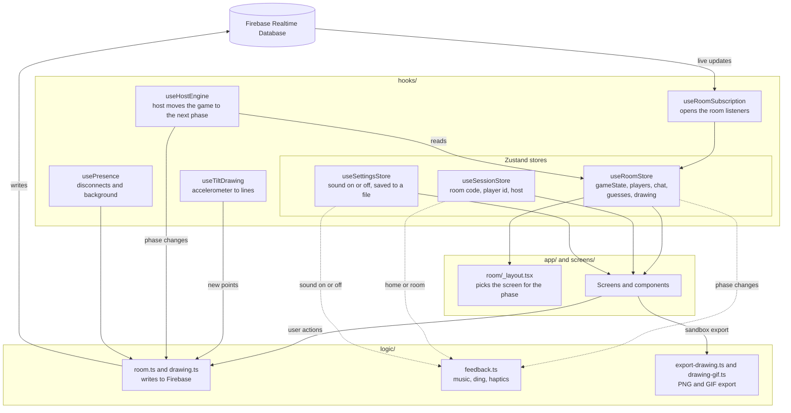
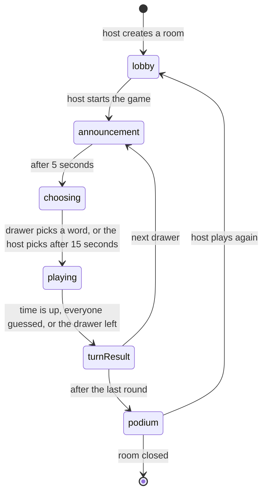

# Tiltionary

A multiplayer drawing and guessing game for your phone, where you draw by **tilting** it.
You drop a ball on the canvas and roll it around to draw the word you were given.
The other players guess in the chat, and the faster you guess, the more points you score.

Built with Expo, React Native, Expo Router, Zustand and the Firebase Realtime Database.

## Features

- **Tilt to draw.** The accelerometer rolls a ball over the canvas. Tap to lift the pen, and pick an ink color at any moment, even mid-line.
- **Real-time multiplayer.** Create a room with a four-digit code, and friends join from their own phones. The drawing streams to every player live.
- **Scoring.** Guessers earn up to 1000 points for speed, plus a bonus for the first three correct guesses. The drawer earns points for every player who guesses the word.
- **Sandbox.** Practise the controls on your own, then save or share your drawing as a photo or as an animated GIF that replays how you drew it.
- **Background music** for the home screen, the waiting room, the game and the podium, with one toggle on the home screen that turns off all sound.
- **Presence handling.** When the host leaves, the room closes for everyone. When a guest leaves, the game continues without them.

## How to play

1. Hold your phone flat.
2. Tap the canvas to drop the ball.
3. Tilt your phone to roll the ball and draw.
4. Tap to lift the pen, and let go to put it down again.
5. Use the buttons below the canvas to undo a line or clear everything.

Everyone draws once per round. The host picks the number of rounds, the drawing time and the word pack in the waiting room.

## Getting started

The app uses native modules such as the accelerometer, haptics and audio, so it runs in a development build instead of Expo Go.

```bash
npm install
npx expo run:ios      # or: npx expo run:android
```

After the first build, `npx expo start` is enough to reload JavaScript changes.

### Changing the music

The music lives in `assets/music`, and `logic/feedback.ts` decides which file plays where.
Screens that share a file keep the song playing without restarting when you move between them.

| File | Plays on |
| --- | --- |
| `lobby-music.mp3` | Home screen, sandbox and waiting room |
| `game-music.mp3` | Announcement, word choice, drawing, turn results and podium |

## Project structure

```text
src/
├── app/                 Routes (Expo Router). Thin files that render a screen.
│   ├── _layout.tsx      Root stack: home or room, based on the session
│   ├── index.tsx        /            Home screen
│   ├── sandbox.tsx      /sandbox     Free drawing
│   └── room/
│       ├── _layout.tsx  Room stack: one screen per game phase
│       ├── loading.tsx
│       ├── waiting.tsx       phase "lobby"
│       ├── announcement.tsx  phase "announcement"
│       ├── play.tsx          phases "choosing" and "playing"
│       ├── result.tsx        phase "turnResult"
│       └── podium.tsx        phase "podium"
├── screens/             The full screens that the routes render
├── components/          Reusable UI: button, canvas, chat, digit tiles, dropdown
├── hooks/               State and side effects
│   ├── use-*-store.ts   Zustand stores: session, room, settings
│   └── use-*.ts         Hooks for Firebase listeners, host engine, drawing
├── logic/               Plain TypeScript with no React
│   ├── room.ts          Every write to a room in Firebase
│   ├── drawing.ts       Sending and reading the drawing
│   ├── scoring.ts       Points rules
│   ├── feedback.ts      Music, the "ding" and phase haptics
│   ├── export-drawing.ts  Save or share as PNG or GIF
│   └── drawing-gif.ts   Renders a drawing into an animated GIF
├── constants/theme.ts   Design tokens: colors, fonts, spacing, radius, outlines
├── data/words.ts        Word packs
└── types/               Types for Firebase data and for gifenc
assets/
├── music/               Background music, one file per part of the app
└── ding.mp3             Sound for a correct guess
```

### How the pieces connect

Screens never talk to Firebase directly.
One hook listens to the room and writes everything into a Zustand store, and screens read from that store.
Actions go the other way, through the plain functions in `logic/`.



### Game phases

The status of the game lives in Firebase, so every phone shows the same phase at the same time.
Only the host's phone moves the game forward, when a phase's timer runs out or when everyone has guessed.



## Design

The look follows a styleboard based on Google's developer event branding.

- **Colors.** Four brand colors, blue, red, yellow and green, each with a pastel tint. Every screen supports light and dark mode.
- **Flat shapes.** Thin outlines replace shadows. Buttons and inputs are pills, and cards have large rounded corners.
- **Type.** Google Sans for text and Google Sans Code for the small `// labels` above sections.
- **Motifs.** Countdown-style digit tiles for the room code and timers, a ticket card for the turn result, and colored blocks for the podium.

All tokens live in `src/constants/theme.ts`, and the shared `Button`, `ThemedText`, `ThemedView` and `DigitTiles` components use them.

## Code conventions

**Effects live in hooks.**
Screens and components contain no `useEffect`.
Firebase data reaches screens through the room store, like the order store in the course example.
Every remaining effect is inside a hook in `hooks/`, and it only connects to something outside React: a Firebase listener, the accelerometer, the app state, a timer or a native animation.
Music and haptics subscribe to the stores directly in `logic/feedback.ts`, so they need no effect at all.

**Comments follow one structure.**
- Every file opens with a short `//` header that says what the file is for.
- Exported functions, hooks, stores and constants have a `/** */` doc comment of one or two sentences.
- Inline `//` comments explain why, never what, in full sentences.
- Long files are split into sections with `// ---- Name ----`.

**Language.**
The code and comments are in English. The interface is in Dutch.
